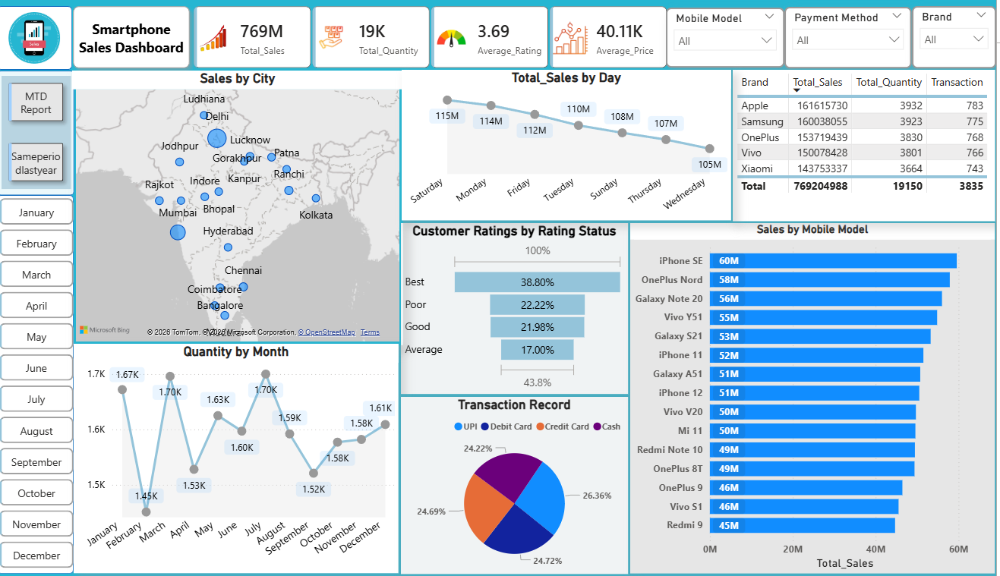

# Mobile-Sales-Dashboard

##  Overview

This project is an interactive Power BI dashboard built to analyze mobile sales performance, customer behavior, and trends.

---

##  Dashboard Preview

---

##  Key Features

* KPI Cards (Total Sales, Quantity, Rating, Price)
* Sales by City (Map)
* Sales by Day & Month trends
* Customer Ratings Analysis
* Sales by Mobile Model
* Payment Method Distribution
* MTD & Yearly Comparison

---

##  Tools Used

* Power BI
* DAX
* Excel

---

##  Files Included

* Power BI Dashboard (.pbix)
* Dataset (.xlsx)
* Dashboard Screenshots

---

##  Insights

* Sales show consistent performance with periodic peaks, indicating stable demand.
* Certain weekdays generate higher sales, reflecting customer buying behavior.
* Metro cities contribute significantly higher sales compared to smaller regions.
* Majority of customers fall under the "Best" rating category, though improvement is needed for lower ratings.
* Premium and mid-range smartphones dominate the market, with Apple and OnePlus leading.
* Payment methods are evenly distributed across UPI, cards, and cash.
* Monthly trends highlight seasonal fluctuations in sales.
* Year-over-year analysis shows overall growth in sales performance.

---

